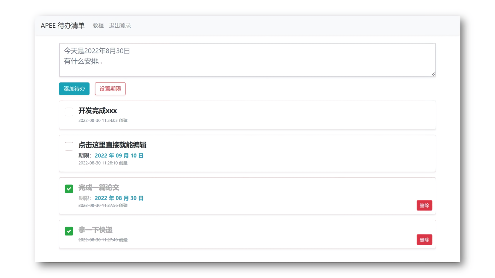

# APEE 待办清单

> 受够了乱七八糟的平台，除了广告就是垃圾功能，我就想简简单单写个待办而已

## 项目信息

- 作者：欧阳鹏（鹏优创工作室）
- 开发时间：2022年8月28日
- 主页：https:/apee.top
- 站点预览：http://i.ouyangpeng.top/dbqd/
- 下载安卓APP：[>>点此下载<<](https://github.com/oyps/apee-to-do-list/releases/download/1.8.30/com.apee.todolist.apk)

## 功能规划

- 一键增加、编辑、删除清单
- 支持安卓APP和网站，需要实现秒开，直达编辑，没有任何阻碍
- 无广告、轻量、纯待办工具，如果发现有广告，我从此绝笔不写软件了
- 根据我自己的需求来开发，说白了是给我自己用的
- 用户系统的话，就是一个账号密码的事，登陆后就没什么事了，什么会员高级功能都给我滚吧

## 使用教程

- 点击列表左边的选框，可以设置事项的完成状态
- 直接点击列表可以编辑内容，编辑时文字颜色变为红色，回车即可保存修改
- 删除事项前，需要先将事项状态设为已完成